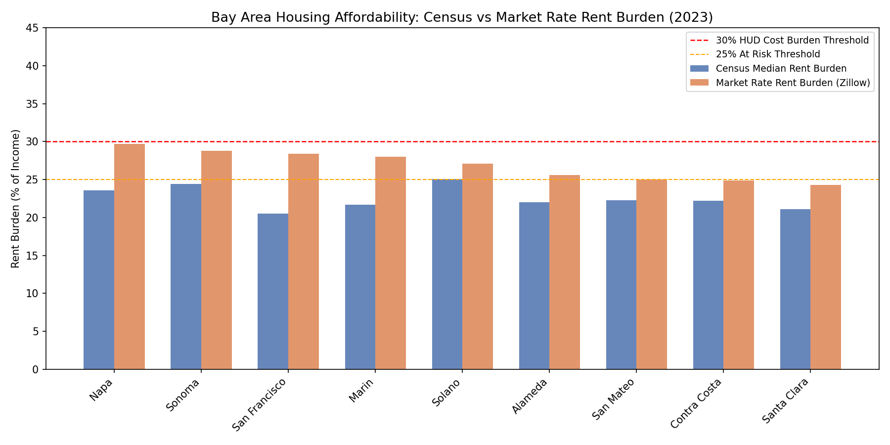
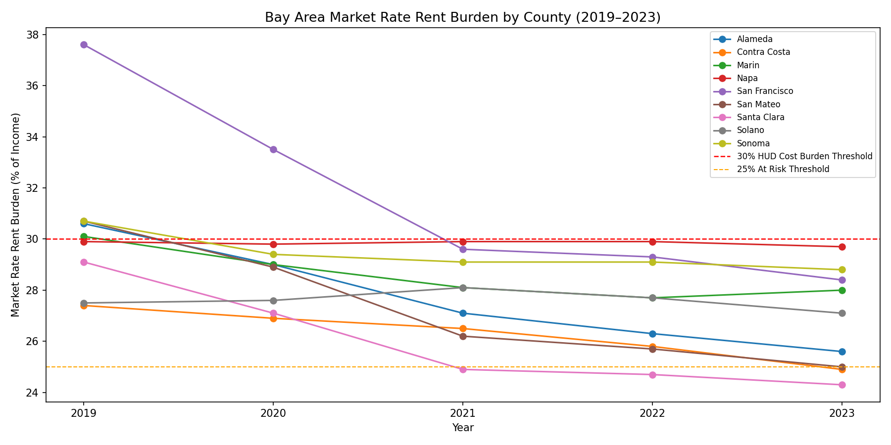
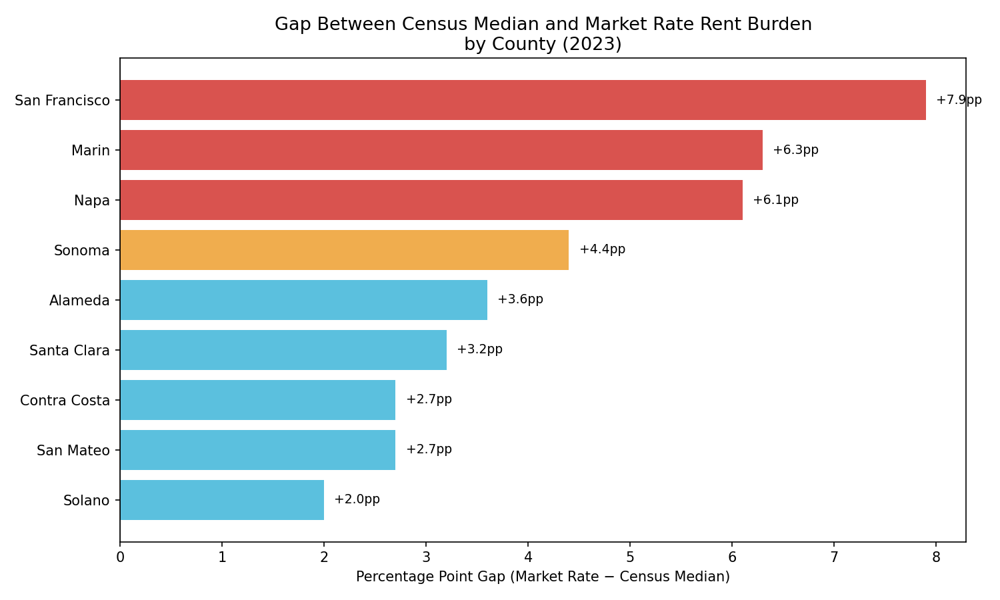

# Bay Area Housing Affordability Analysis (2019–2023)

An analysis of housing affordability across 9 Bay Area counties, comparing 
Census-reported rent burden against actual market-rate rent burden using 
Zillow observed rent data.

## Core Question
How does official Census data compare to market-rate conditions — and which 
Bay Area communities face the greatest hidden affordability burden?

## Tools & Skills
- **Python** (pandas, matplotlib, seaborn, requests)
- **Census ACS API** — median income and rent by county (2019–2023)
- **Zillow ZORI** — market-rate observed rent index by county
- **SQLite** — structured storage and querying
- **SQL** — window functions (LAG, RANK), CASE WHEN, aggregations

## Key Findings
1. **Census data understates rent burden by 2–8 percentage points** across 
   all Bay Area counties. San Francisco shows the largest gap (+7.9pp).
2. **San Francisco improved dramatically** — market-rate burden dropped from 
   37.6% in 2019 to 28.4% in 2023, reflecting COVID-era population outflows.
3. **Napa and Sonoma face the most persistent burden** — remaining near the 
   30% HUD cost-burden threshold throughout the period.
4. **Santa Clara improved most** — tech salary growth outpaced rent increases, 
   dropping market-rate burden from 29.1% to 24.3%.
5. **Solano is the hidden crisis** — lowest rents in the region but highest 
   Census rent burden due to lower incomes.

## Visualizations

### Census vs Market Rate Rent Burden by County (2023)

### Market Rate Rent Burden Trends (2019–2023)

### Gap Between Census and Market Rate Burden

## Data Sources
- [U.S. Census Bureau ACS 5-Year Estimates](https://api.census.gov/data/)
- [Zillow Observed Rent Index (ZORI)](https://www.zillow.com/research/data/)

## How to Run
1. Clone this repo
2. Install dependencies: `pip install pandas matplotlib seaborn requests`
3. Get a free Census API key at [api.census.gov](https://api.census.gov/data/key_signup.html)
4. Add your key to Cell 2 in the notebook
5. Run all cells in `bay_area_housing_affordability.ipynb`